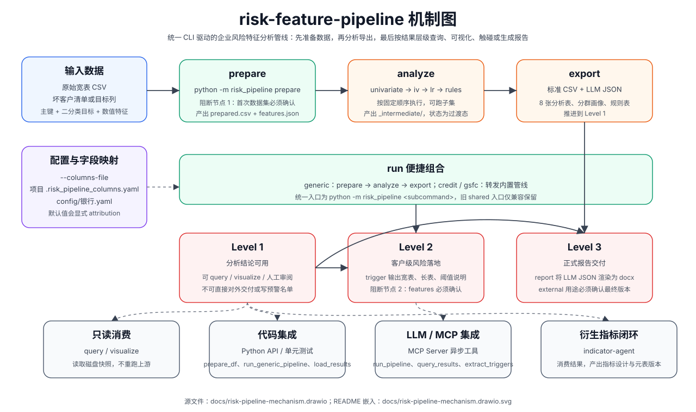

# risk-feature-pipeline 核心管线

`risk-feature-pipeline` 是客户级风险特征分析的核心管线，面向“主键 + 二分类目标 + 数值特征列”的宽表数据，统一通过 `python -m risk_pipeline <subcommand>` 完成数据准备、分群分析、IV/LR/规则挖掘、标准结果导出、客户级触碰、可视化和报告生成。

## 机制图



可编辑源文件见 [`docs/risk-pipeline-mechanism.drawio`](docs/risk-pipeline-mechanism.drawio)。需要调整图时，使用 draw.io / diagrams.net 打开源文件，导出同名 SVG 后保持 README 引用不变。

## 统一入口

所有 agent 工作流和集成调用优先使用统一 CLI：

```bash
python -m risk_pipeline <subcommand> [args]
```

核心子命令如下：

| 子命令 | 作用 | 结果层级 |
|---|---|---|
| `prepare` | 读取宽表和坏客户清单，生成 `prepared.csv` 与 `features.json` | 前置 |
| `analyze` | 按 `univariate → iv → lr → rules` 固定顺序执行分析子集 | 过渡态 |
| `export` | 将 `_intermediate/` 转成标准 CSV、LLM JSON 和分群画像 | Level 1 |
| `query` | 只读已有结果，查询 top IV / LR / 相关性 | 不推进 |
| `visualize` | Level 1 后读取结果 CSV 生成 PNG 图表 | 不推进 |
| `trigger` | 将风险结论落到客户级触碰明细 | Level 2 |
| `report` | 将 LLM JSON 与报告正文渲染为 Word | Level 3 |
| `run` | 便捷组合；`generic` 走 `prepare → analyze → export` | Level 1 |

## 典型流程

自备宽表最常见路径：

```bash
python -m risk_pipeline run --pipeline generic \
  --wide data/raw/我的宽表.csv \
  --bad-customer data/raw/坏客户清单.csv \
  --id-col 客户编号 \
  --target-col is_bad \
  --project 我的项目 \
  --confirmed-new-dataset
```

只想重跑某些分析步骤时：

```bash
python -m risk_pipeline analyze \
  --project 我的项目 \
  --steps univariate,iv,lr,rules \
  --category-dims 企业规模

python -m risk_pipeline export --project 我的项目
```

已有结果只读查询或出图时，不重跑上游：

```bash
python -m risk_pipeline query --project 我的项目 --kind iv --top 15
python -m risk_pipeline visualize --project 我的项目          # 需先装可视化依赖
```

> **可视化依赖**：matplotlib / seaborn 不在核心管线依赖里。首次出图前需要安装：
> ```bash
> pip install -e .[viz]                    # 推荐：同时声明项目可被 import
> # 或
> pip install matplotlib seaborn
> ```
> PEP 668 锁定环境（部分 macOS / CI）请先 `python -m venv .venv && source .venv/bin/activate`，或加 `--break-system-packages`。

## 集成改造要点

- 新银行或新数据源接入：直接编辑 `config/column_mapping.yaml`（字段映射）与 `config/default.yaml`（阈值、路径、IV 参数），CLI 自动读取；**不存在** `--columns-file` / `--config` CLI 入参，也不会自动加载 `.risk_pipeline_columns.yaml` 或 `config/<bank>.yaml`。`prepare` 阶段会做一次列名预检，若 YAML 期望的分群维度在宽表中完全缺失会硬错提示。
- `prepare` 是数据进入管线的唯一标准入口；不要在外部脚本里手写“读宽表 + merge 坏客户 + 推断特征列”。
- `query` 和 `visualize` 都读取磁盘快照，不会自动感知上游数据已变化；重跑分析后需要重新 `export`，再查询或出图。
- `trigger` 会进入客户级运营结果，必须在 Level 1 后执行，并显式确认 features 配置。
- `report` 面向正式交付，`purpose=external` 时必须确认当前结果是最终版本。

更细的 agent 约束、阻断节点和日志规范见 [`AGENTS.md`](AGENTS.md)；面向自然语言调度的说明见 [`SKILL.md`](SKILL.md)。

## 文档辅助

| 文档 | 用途 |
|---|---|
| [`docs/SCHEMA.md`](docs/SCHEMA.md) | 所有 Level 1/Level 2 落盘 CSV 的列字典权威来源（A4 后统一列名、A5 后文件改名） |
| [`docs/GLOSSARY.md`](docs/GLOSSARY.md) | dim / group / scope / coverage 等术语统一表 + 列名跨表对照 + 阻断节点缩写 |
| [`docs/risk-pipeline-mechanism.drawio`](docs/risk-pipeline-mechanism.drawio) | 核心管线机制图源文件 |
